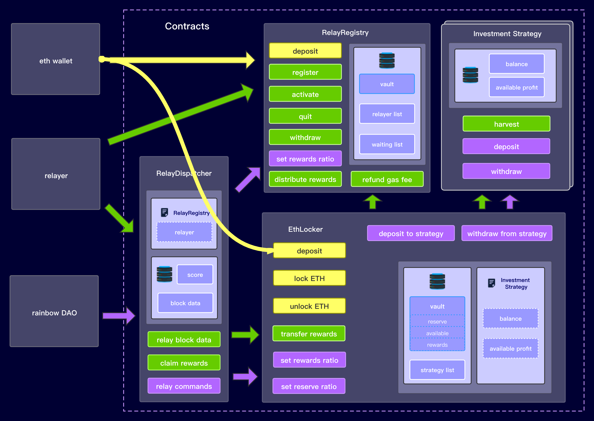

# DRN-sol

[](https://opensource.org/licenses/Apache-2.0)

DRN-sol is a set of Ethereum Smart Contracts that use idle funds in the locker to carry out risk-free financial management, so that to motivate relayers with income.

## Structure



## Usage flow

### RelayRegistry.sol

#### Registration process

1. Anyone can register as a relayer by sending `relayRegistry.register()` with ethers that `stakingRequired`.
2. If relayerList reaches the `relayerLengthLimit`, the registrant will be a candidate, or he will be listed as a relayer.
3. Candidates can invoke `activate()` to become a relayer when they find the `relayerList.length` is less than `relayerLengthLimit`.

#### Work process

Everytime a relayer invokes `claimRewards()` in NearRelayDispatcher.sol, the `distributeRewards()` will be used. It will count all their contributions in the past period of time, and therefore determine the amount of rewards distributed and whether to slash.

#### Quit process

1. If a candidate invokes `quit()` , his staking assets will move to his balance, so he can `withdraw(uint256 amount)` or `withdrawAll()`.
2. If a relayer invokes `quit()` , he will be delisted immediately, but his staking assets will be frozen for `freezingPeriod`. If he did'nt be slashed in that period, then he can invoke `unfreezingToBalance()` to move the staking assets to his balance.
3. Everyone can `withdraw(uint256 amount)` or `withdrawAll()`  their balance.


### EthLocker.sol

#### Lock and unlock process

1. Anyone can lock eth by sending `ethLocker.lockEth()` with ethers that wants to transfer to near.

2. When users want to unlock their ethers, they can use the proof data from Near and invoke `ethLocker.unlock(bytes proof)` to achieve that.

3. When `unlock` be invoked, there are two situations. If the balance of Locker is sufficient, the user will get all his ethers back. Or, the locker will calculate the safe amount as withdrawable to transfer to user, and the rest amount is recorded as debt.

   Formula to calculate the amount that can be withdrawn in an unlocking:

   ```
   withdrawableBalance = lockerBalance - minReserveRatio * (lockedEth - unlockAmount)
   ```

   According to this formula, after each unlock, it always meets the condition:

   ```
   reserveBalance >= minReserveRatio * lockedEth
   ```

4. When debt is created, event `DebtCreated`  will be emitted. RainbowDao can issue a instruction to withdraw funds from the investment contracts or deposit to the locker directly. After that, the user can `claim()` and get rest ethers back.

#### Investment process

RainbowDao can issue a instruction to call `depositToStrategy(address strategyAddr, uint256 amount)` , which is used to invest in the strategies, or call `withdrawFromStrategy(address strategyAddr, uint256 amount)` for redemption.

#### Transfer rewards process

Everytime the relayers invoke `claimRewards()` in NearRelayDispatcher.sol, `ethLocker.transferRewards()` will be called, which will `harvestAll()` and transfer the ethers to RelayRegistry. After that,  `distributeRewards()` will be executed in RelayRegistry.sol.


### NearRelayDispatcher.sol

#### Light client block Relaying process

1. relayers invoke `relayLightClientBlock(bytes memory data)` to sync blocks from Near to NearBridge.sol on Ethereum. Once successful relayers will get scores. 
2. Once successful relayers will get scores. The first one successfully gets a high score, in the next 5 blocks successfully get a medium score, and the next 30 blocks successfully get a low score.
3. Relayers can invoke `claimRewards()` after each scoring period ends. This function will harvest all the profit from investment strategies and send to RelayRegistry. Then the RelayRegistry will distribute part of them according to the scores of relayers and the `rewardsRatio`. If someone's score deviates too far from the average, he will be slashed.

#### Commands Relaying process

1. Every instruction by RainbowDao to the contracts must be relayed by `relayCommandFromDao(bytes calldata data, uint64 proofBlockHeight)` in NearRelayDispatcher. This function verifies whether the command comes from RainbowDao, and whether it has been used already.
2. If the command be verified, it will be relayed and execut. After all functions are executed, the gas fee will be refunded to the tx sender.

#### Claim rewards process

If the claim is successful, the gas fee will be refunded to the tx sender.


## To be discussed

- the rule of scoring
- the rule of slashing


## Testing

```
cd DRN-sol
yarn
truffle test
```

More test cases are being added...